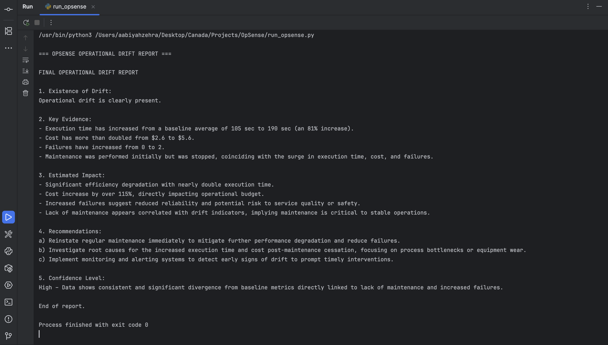

# OpSense  
An Agentic AI System for Detecting Operational Drift

OpSense is a personal project exploring how to build **agentic systems** using **OpenAI’s AgentKit concepts**, moving beyond single-prompt LLM usage toward autonomous reasoning, tool selection, and deterministic decision-making.

The system analyzes operational data, detects gradual performance or cost drift, and produces actionable optimization recommendations with clear, explainable reasoning.

---

## Core Idea

Most real-world systems do not fail abruptly.  
They degrade gradually — becoming slower, more expensive, and less reliable over time.

OpSense is designed to reason about this *operational drift* in a structured way:
- Establish historical baselines
- Compare current behavior against expectations
- Quantify degradation
- Decide when enough evidence exists
- Produce a final, actionable report

---

## Project Scope and Data

This project uses **dummy operational data** to simulate real-world systems such as:
- Automated pipelines
- Scheduled jobs
- Platform workflows
- Infrastructure-like processes

The dummy data is intentionally designed to reflect realistic patterns such as:
- Gradual increases in execution time
- Cost creep
- Reduced maintenance frequency
- Rising failure counts

Although the data is synthetic, the reasoning architecture is designed to transfer directly to real production systems.

---

## Why Agentic AI (Not Just Prompts)

Traditional LLM usage typically follows a single-step pattern:
- One prompt
- One response
- No autonomy or decision-making

OpSense implements an **agent loop** built on OpenAI’s Responses API that allows the model to:
- Decide whether tools are needed
- Call tools dynamically
- Incorporate tool outputs into reasoning
- Converge to a final decision deterministically

This reflects how **AgentKit-style systems** are intended to function in real-world applications.

---

## Architecture Overview

OpSense uses a **two-phase agent controller**.

### Phase 1 — Tool-Aware Reasoning
- The agent analyzes operational data
- Quantitative validation is performed via tools when needed
- Tool outputs are injected back into the agent’s context

### Phase 2 — Forced Finalization
- Tool usage is disabled
- The agent is required to produce a final report
- This guarantees termination and avoids infinite reasoning loops

This design ensures:
- Explainability
- Deterministic stopping conditions
- Robust behavior under API rate limits

---

## Tools

OpSense currently includes deterministic tools for:
- Baseline metric calculation
- Current-state extraction
- Execution time and cost drift computation

These tools:
- Run locally
- Are non-LLM
- Provide grounded numerical evidence
- Are invoked autonomously by the agent

---

## Example Test Run

Below is a screenshot from a successful test run using dummy operational data:



The output demonstrates:
- Detection of operational drift
- Clear evidence-based reasoning
- Actionable recommendations
- A confidence assessment

---

## Why This Project Is Versatile

Although OpSense currently operates on generic operational logs, the same agent architecture applies across multiple domains:

- **FinTech**: transaction latency, retries, cost creep  
- **HealthTech**: workflow throughput, processing delays  
- **Infrastructure / Energy**: uptime degradation, maintenance gaps  
- **Large-scale SaaS systems**: job runtimes, operational inefficiencies  

Only the input data schema changes.  
The agent reasoning framework remains the same.

---

## Tech Stack

- Python 3.9+
- OpenAI Responses API
- Tool (function) calling
- Custom agent loop (AgentKit-style)
- Local execution
- No databases or external orchestration frameworks

---

## How to Run

1. Install dependencies:
   ```bash
   pip install --upgrade openai numpy
2. Set your API key:
    ```bash
    export OPENAI_API_KEY=your_key_here
3. Run the main script:
    ```bash
    python run_OpSense.py
   
---

## Design Principles:
- Explainability over black-box behavior 
- Deterministic stopping conditions 
- Tool-grounded reasoning 
- Agent autonomy with guardrails 
- Free-tier-friendly experimentation

---

## Status:
OpSense is an experimental, learning-focused project designed to explore agentic AI patterns and real-world operational reasoning using OpenAI’s AgentKit concepts.

---

## Author:

Developed by Aabiyah Zehra
[LinkedIn](https://www.linkedin.com/in/aabiyah-zehra-526528202/) | [GitHub](github.com/aabiyah)
